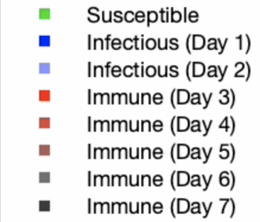
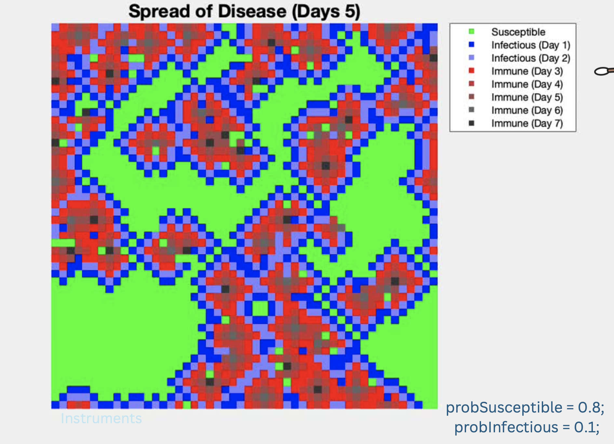

# Spread-of-Disease
- November 26, 2024
- MTH 4170 - Modeling and Simulation
- Belmont University
- Author: Numa Rahman, Savitha Samudrala

# 1. Introduction
The spread of contagious diseases typically occurs when infectious factors, such as viruses, bacteria, or other pathogens, transfer from one individual to another. This is often due to physical contact or shared surfaces. Factors like spatial population density, immunity levels, and the nature of the pathogen influence how rapidly a disease propagates. In the case of stomach viruses, which are usually caused by highly contagious pathogens like noroviruses, transmission often occurs through contaminated food, water, surfaces, or close contact with infected individuals. These viruses are marked for their ability to spread quickly in environments where people are in close proximity.

Modeling the spread of contagious diseases is crucial for interpreting epidemic dynamics and un- derstanding possible control measures. In this project, we develop a simulation to analyze the spread of a stomach virus in a sampled population model. The simulation combines the SIR model and cel- lular automata to visualize disease dynamics. The simulation incorporates assumptions about disease progression, immunity duration, and interaction rules to explore how varying susceptibility and initial infection probabilities influence the spread over time.

This project contains key distinctions on how the infection dynamics deviate from the standard SIR model. The standard SIR model assumes every infected individual has equal access to every susceptible individual, regardless of spatial proximity. In contrast, this project incorporates spatial dependence by combining the SIR model with cellular automata. Here, individuals are arranged on a grid, and the likelihood of disease transmission is determined by proximity. An infectious individual can only spread the disease to neighboring cells representing susceptible individuals. This spatial dependence significantly alters how the disease propagates by simulating real-world scenarios where transmission often occurs through close contact. Furthermore, unlike the standard SIR model, which assumes permanent immunity, this project introduces a variation where immunity is temporary, and individuals return to the susceptible group after five days.

By integrating the modified SIR model with cellular automata, the simulation provides dynamic visualizations of disease spread, highlighting how initial conditions, proximity, and spatial constraints influence epidemic patterns. To visually demonstrate the disease’s progression, it is important to understand the concepts of the models used to offer insights into epidemic dynamics.

# 2. Background

Understanding the dynamics of disease spread in our simulation requires examining the fundamental components of the models used: the SIR model and cellular automata. Together, these frameworks create a realistic representation of how contagious disease propagate within a population.

## 2.1 SIR Model

The SIR model is an important framework for epidemiological modeling. The SIR model categorizes a population into three groups: susceptible, infectious, and recovered. Susceptible individuals can contract the illness, infectious individuals are capable of spreading it, and recovered individuals have overcome the illness and are assumed immune. The SIR model describes transitions between susceptible, infectious, and recovered based on infection and recovery rates using these differential equations:

dS = −rSI, (1) dt
dI =rSI−aI, (2) dt
dR = aI. (3) dt

In these equations, S, I, and R represent the number of susceptible, infected, and recovered indi- viduals, respectively. The parameters r (disease transmission rate) and a (recovery rate) control the rates of transition between these states. These equations model the rate of change of the susceptible, infected, and recovered populations to describe how the proportion of individuals in each state changes over time.

Since the SIR model assumes all individuals interact equally and does not account for their physical locations, we have derived the populations from this model and combined those concepts with cellular automata to accurately depict how proximity often governs the likelihood of disease transmission in our simulation.

## 2.2 Cellular Automata
Cellular automata are computational models used to simulate dynamic systems that evolve over discrete time steps. They consist of a grid of cells, where each cell can exist in one of several states. The state of a cell at any given time is determined by a set of predefined rules that consider the states of neighboring cells. Cellular automata are widely used to model processes influenced by local interactions, such as the spread of fire, traffic flow, or biological phenomena, because they effectively capture the spatial and temporal dynamics of such systems.

Cellular automata is incorporated in our simulation to introduce spatial dynamics to combat the limitations of the standard SIR model. In our cellular automaton, we used a grid-based structure where each cell represents an individual in one of the SIR states. The state of each cell evolves over discrete time steps based on local interaction rules, with disease transmission limited to neighboring cells. In other words, an infectious cell can only spread the disease to nearby susceptible cells, applying real-world conditions where close contact drives transmission. This is the idea of spatial population density, where the arrangement of individuals within a given space significantly impacts the dynamics of disease propagation.

This simulation bridges the gap between epidemiological modeling and real-world scenarios where spatial constraints influence transmission. The use of a grid-based population introduces spatial struc- ture, enabling a closer examination of how proximity and density influence disease spread.

# 3. Methods
This simulation models the spread of a stomach virus within a population using a grid-based cellular automaton. Aforementioned, our simulation is conducted on a grid where each cell represents an individual, with three possible health states: susceptible, infectious, or immune. After initialization, the model evolves deterministically, with each cell’s state updated at every time step based on defined transition rules that account for the states of its immediate neighbors. The primary goal of the simulation is to analyze how different initial probabilities of susceptibility and infection influence the spread of the virus over time.

## 3.1 State Definitions and Transitions
<b>State Definitions</b> Each grid point, representing an individual, is assigned a health state with a value between 0 and 7:

• <b>Susceptible (S):</b> Assigned the value 0. Susceptible individuals are vulnerable to infection if at least one infectious neighbor is present.
• <b>Infectious (I):</b> Represented by values 1 (first day of infection, I1) and 2 (second day of infection, I2). Infectious individuals spread the virus to neighboring susceptible cells. After one day, I1 transitions to I2, and after another day, I2 transitions to the immune state.
• <b>Immune (R):</b> Represented by values 3 through 7, corresponding to the five days of immunity (R1 to R5). Immune individuals transition sequentially through these states, returning to the susceptible state (0) after R5.

<b>Deterministic Transition Rules</b> At each time step, all grid points are updated simultaneously based on the following rules:

<b>1. Susceptible to Infectious:</b> A susceptible individual (S = 0) transitions to I1 if any of its four immediate neighbors (north, south, east, west) is infectious (I1 or I2).

<b>2. Progression of Infection:</b>

I1 → I2 (after one day), I2 → R1 (after one day).

<b>3. Progression of Immunity:</b>

Rn → Rn+1 (n=1to4), R5 → S.

This structured framework ensures that each individual’s health state evolves deterministically, based on their current state and interactions with neighbors.

## 3.2 Initialization
The simulation begins with a grid of individuals, where each cell is assigned an initial state based on predefined probabilities. These probabilities define the distribution of individuals across the three health states at the start of the simulation.

probSusceptible = Probability of being initially susceptible, 

probInfectious = Probability of being initially infectious.

The probability of susceptibility determines the fraction of the population that begins in the susceptible state. These individuals are vulnerable to contracting the virus if exposed to an infectious neighbor.

A higher probSusceptible implies a larger portion of the population is susceptible, potentially allowing the virus to spread more widely.

The probability of infectiousness specifies the proportion of individuals who are initially infectious. These individuals are evenly distributed between the first and second days of infection, establishing the initial intensity of the outbreak. A larger probInfectious can lead to faster transmission at the onset of the simulation.

The remainder of the population is assigned to the immune state, calculated as 1−probSusceptible− probInfectious. Immune individuals begin the simulation in one of five immunity stages (R1 to R5), which are assigned randomly and are uniformly distributed. The presence of immune individuals reduces the pool of susceptible individuals, slowing the virus’s spread and offering initial protection.

## 3.3 Visualization
The simulation uses a color-coded grid to represent the states of individuals:
• <b>Susceptible (S):</b> Green.
• <b>Infectious (I):</b> Full blue for I1 and pale blue for I2.
• <b>Immune (R):</b> Red for R1, transitioning to progressively darker shades of red for R2 through R5.

Figure 1: Color Map for Spread of Disease Simulation.

The grid updates at each time step, providing a dynamic visual representation of the virus’s spread and recovery patterns over time.

## 3.4 Model Assumptions

The model is built upon a set of foundational assumptions to simplify the simulation while retaining its core dynamics. First, the population is considered static, meaning that there are no births, deaths, or migrations throughout the simulation. This assumption allows the focus to remain on the progression of the disease and the interaction between individuals without introducing external demographic changes.

Disease transmission is restricted to direct neighbors within the grid. An individual can only be infected if at least one of their adjacent neighbors—located to the north, south, east, or west—is in an infectious state. This localized transmission reflects real-world scenarios where diseases primarily spread through close contact.

The duration of both infection and immunity is fixed to ensure consistency across the simulation. Infection lasts exactly two days, with individuals progressing through two stages of infectiousness before transitioning to immunity. Similarly, immunity is temporary, persisting for five days before individuals revert to the susceptible state. These fixed durations simplify the progression rules and allow for deterministic transitions.

Finally, the model assumes that all state changes are deterministic and that no randomness is introduced after the initial assignment of states. Once the grid is initialized based on predefined probabilities for susceptibility and infectiousness, the evolution of the system is entirely determined by the rules governing state transitions.

# 4. Results
This simulation explored two distinct scenarios to analyze the spread of a stomach virus under varying initial conditions: high susceptibility with low infection and low susceptibility with high infection. These scenarios highlight how the composition of the initial population influences the dynamics of disease propagation over time.

## 4.1 High Susceptibility, Low Infection
We first examined a scenario where the probability of susceptibility was set to 0.8, and the prob- ability of infection was set to 0.1. This indicates that 80% of the population is initially susceptible, while 10% of the population is infectious. The remaining 10% are immune to the virus. The goal was to observe how the virus spreads in a population that is largely unprotected against infection. The graph shows the simulation paused at Day 5 to demonstrate the state of the population.

Figure 2: Simulation paused at Day 5 with probability of susceptibility = 0.8 and probability of infection = 0.1
 
In this scenario, the large susceptible population enabled the virus to spread steadily across the grid. Clusters of infection formed as infected individuals (I1 and I2) transmitted the virus to their susceptible neighbors. Over time, these clusters expanded, and more individuals transitioned to the immune state (R1 through R5). By the middle of the simulation, immune individuals began to dominate the grid, halting further spread of the virus.

The spread of the virus was slow initially due to the limited number of infectious individuals. However, as the infection spread, the population transitioned through distinct stages:

1. Rapid growth: The number of infected individuals increased as clusters of infection grew.
2. Stabilization: The outbreak peaked and began to stabilize as more individuals transitioned to immune states.
3. Decline: The infection subsided as the majority of the population became immune, leaving fewer susceptible individuals to sustain transmission.
4. Populations with high susceptibility but limited initial infections experience prolonged outbreaks, with the potential for widespread immunity over time. The slow progression allows for visible clustering of infection before stabilization.

## 4.2 Low Susceptibility, High Infection
In contrast, in Figure 3, the probability of susceptibility is set to 0.2, and the probability of infection is set to 0.7, indicating that 20% of the population is initially susceptible, 70% of the population is infectious, and the remaining 10% are immune to the virus. This will help illustrate how outbreaks behave when susceptibility is low, but infection is widespread. The simulation was paused at Day 5 to compare the similarities and differences to the scenario above, which featured high susceptibility and low infectious probabilities.

Figure 3: Simulation paused at Day 5 with probability of susceptibility = 0.2 and probability of infection = 0.7.

In this scenario, the virus spread rapidly in the early timesteps with a high proportion of initially infectious individuals. Susceptible individuals were quickly infected, and the transition to immune states occurred faster than in the high-susceptibility scenario. Immune individuals (R1 through R5) formed significant clusters early on, limiting the virus’s reach.

The outbreak unfolded as follows:
1. Fast initial spread: The high number of infectious individuals quickly depleted the susceptible population.
2. Early immunity dominance: The rapid spread resulted in a large number of immune individuals within a short timeframe.
3. Limited propagation: With fewer susceptible individuals, the virus’s ability to propagate was constrained, and the outbreak subsided earlier.
4. 
In populations with low susceptibility and high initial infections, the outbreak peaks quickly but affects a smaller proportion of the population overall. This scenario highlights the importance of initial susceptibility in determining the scale and duration of an outbreak.

## 4.3 Discussion
The results of this simulation provide valuable insights into how initial conditions shape the pro- gression of an epidemic. In real-world scenarios, populations with high susceptibility, such as those with low vaccination rates, may experience prolonged outbreaks with significant overall impact. Con- versely, high initial infection rates, as seen in rapidly spreading variants, can lead to short but intense outbreaks. These dynamics underscore the importance of early interventions to reduce susceptibility and limit initial infections.

The spatial clustering observed in the simulation reflects real-world patterns, where localized trans- mission often drives epidemic spread. This highlights the relevance of geographically targeted public health measures, such as localized lockdowns, contact tracing, and vaccination campaigns, to control outbreaks effectively.

However, the model’s deterministic nature and uniform grid structure limit its ability to capture real-world complexities, such as individual mobility and heterogeneous population densities. Future extensions could incorporate stochastic elements, uneven spatial distributions, or interventions like vaccination strategies to further refine the model’s applicability.

# 5. Conclusion
This project demonstrates the power of integrating the SIR model with cellular automata to sim- ulate the spatial dynamics of a stomach virus within a closed population. The simulation effectively captures disease dynamics, showing how varying initial probabilities of susceptibility and infection can influence the spread, containment, and eventual eradication of the disease over time.

The results show different patterns of disease propagation. Populations with high susceptibility experience longer outbreaks with visible clusters of infection. Conversely, scenarios with high initial infection rates demonstrate rapid outbreaks. These findings reflect epidemic challenges, where factors like spatial population density, immunity levels, and initial conditions critically influence how the diseases progress.

This simulation demonstrated the importance of implementing public health strategies to specific population conditions. For example, in high-susceptibility environments, interventions like vaccination campaigns and public awareness programs can prevent outbreaks. In scenarios with high initial infec- tions, rapid responses such as localized quarantines and contact tracing can help contain the spread of the disease. By continuing to refine the model, we can better understand and predict disease dynamics in diverse settings, providing a way to manage and mitigate the impact of diseases.

In a world increasingly shaped by the emergence of new pathogens and the resurgence of old ones, this project highlights the critical role of spatial models in understanding epidemic dynamics. The mixture of susceptibility, infection, and immunity in the simulation replicates the challenges faced by our public health system. Future considerations include incorporating factors such as demographic changes, stochastic variability, and vaccination effects, in order to observe differences in simulation outcomes and model behavior.

# References
[1] Shiflet, A. B., & Shiflet, G. W. (2014). Introduction to Computational Science (2nd ed.). Prince- ton University Press. Retrieved from https://belmont-bookshelf.vitalsource.com/books/ 9781400850556
